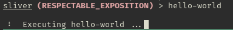
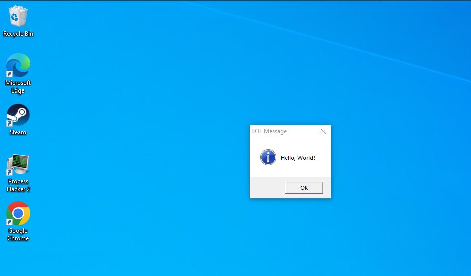

# Hello World BOF for Sliver

## Instructions


- Install Repo
```bash
git clone https://github.com/steve0ro/SliverBOFs

```

- Run make to compile code
```bash
make
```

-  In sliver-client

```bash

sliver (RESPECTABLE_EXPOSITION) > extensions load /path/to/SliverBOFs/HelloWorld/


sliver (RESPECTABLE_EXPOSITION) > extensions install /path/to/SliverBOFs/HelloWorld/
```

- In a Sliver session, run hello-world

```bash
sliver (RESPECTABLE_EXPOSITION) > hello-world 
```



- Hello World pop up on Windows



- To remove extension
```bash
sliver (RESPECTABLE_EXPOSITION) > extension rm hello-world 
```
